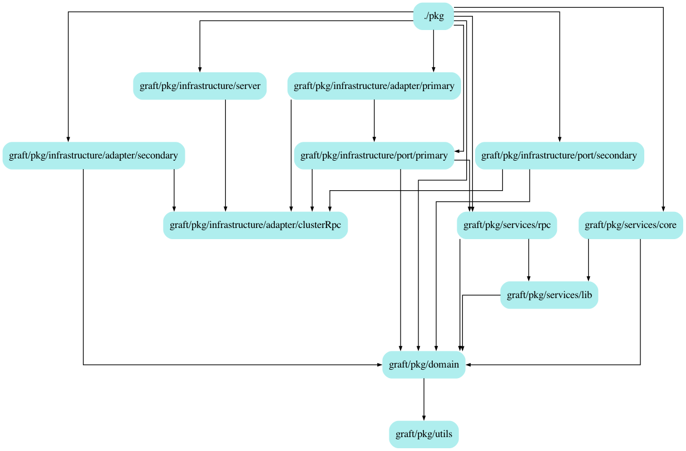

# Graft

[Raft distributed consensus](https://raft.github.io/raft.pdf) in go.

There already exists multiple mature and battle tested implementations of Raft consensus in Go (and other languages).
Graft is still **under heavy development and testing.**. Contrary to existings projects, Graft focuses on:
- Clean / modular architecture
- Ease of use

Why do you need Graft for ?

Graft help you make any state machine resilient and distributed through distributed consensus.

<br />
<br />

### Code architecture

```sh
godepgraph -novendor -s -p github.com,google.golang.org,gopkg.in ./pkg | dot -Tpng -o graft.png
```




The architecture is based on Clean/Hexagonal principles:
- **The inner most dependency is `pkg/domain`.** It is imported by all, and it imports no-one. This is were the business logic lives. It depends on nothing, and **everything** depends on it.
- **The middle dependency is `pkg/services`.** It implements use-cases, services, API logic. It provide services and application logic that consume the domain and provide response for the outside world.
- **The outer most dependency is `pkg/infrastructure`**. It implements adapter and port for providing interfaces to access use-case/services and domain logic. This is where framework, drivers, libs etc... lives. **Nothing** depends on the infrastructure layer.


### Graft refactoring status

```
TODO:
- add command options, start/add in same command ?
- graceful stop grpc when quit
- gRPC API error with status code
- (done) logging interface, + remove logrus dependencies
- (done) Document graph of deps / hexagonal architecture
- (done) FSM execution bindings
- (done) Client command (support for leader redirection)
- (done) Mutual TLS
- (done) Rename the use case and the servers
- (done) Log level sanitization
- (done) Refactor FSM state => immutable, return copy, Getters/Withers
```

### Raft implementation status

```
DONE:
- Leadership transfer execution
- Membership change
- Leader election
- Log replication
- Automatic step down leader
- Pre vote

TODO:
- Log compaction
```

FIX:
1. start cluster
2. add 2 peers
3. shutdown leader
4. restart leader
=> start leader fails disturb the cluster as existing peers dont know about the old leader
=> need to restart leader with `cluster add` to prevent disturbing the cluster

```sh
# Command organization:

start [id:port] --cluster [id:port] -> start node and append to cluster
stop [id:port] --cluster [id:port] -> remove node from cluster + stop


start
stop
add
remove

leader
execute
configuration
```
